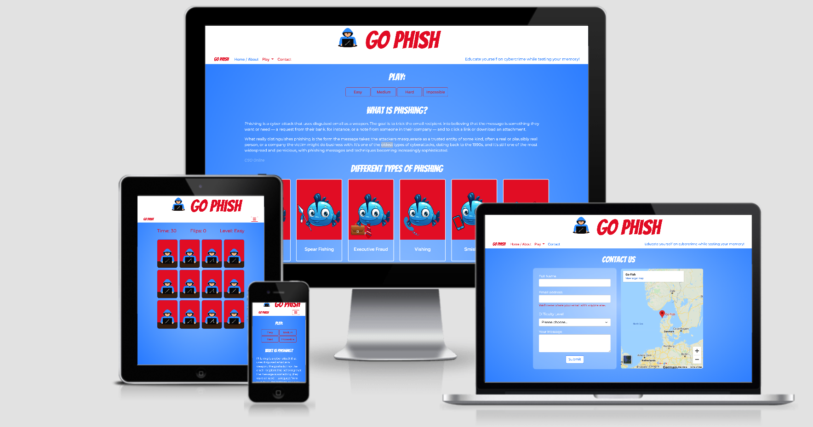
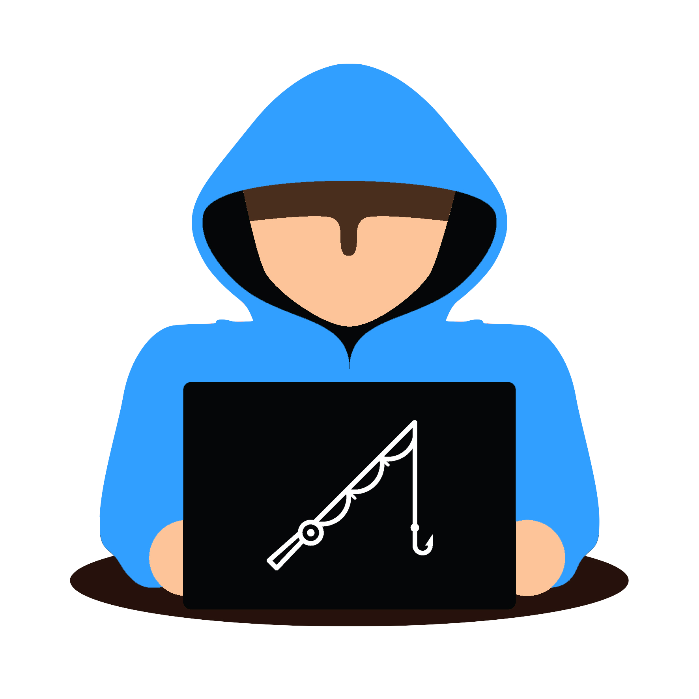
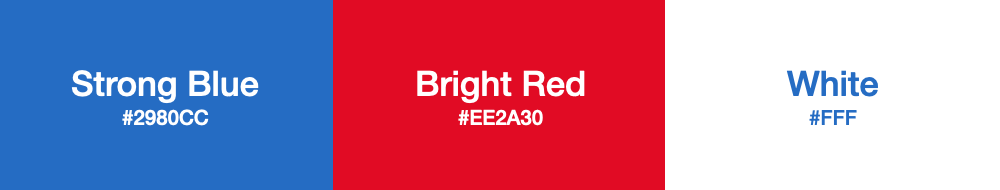
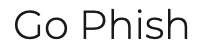
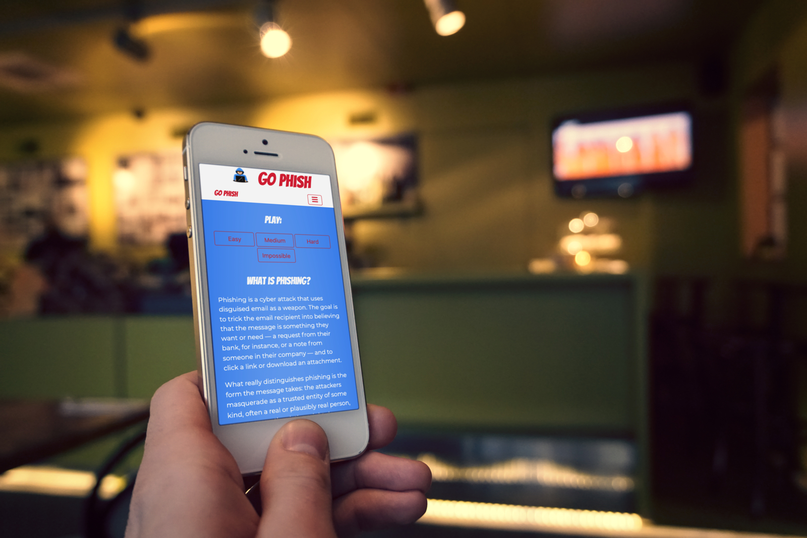

<h1 align="center">Go Phish</h1>
<h1 align="center"></h1>

<a href="https://marcusnolan.github.io/Milestone-2-Go-Phish/"> : Go Phish Live Website</a>

<a href="https://github.com/marcusnolan/Milestone-2-Go-Phish"> : Go Phish Github Repository</a>

## About
Go Phish is a card memory game created to educate people about the ongoing threat of cybercrime, specifically Phishing while also letting them test their memory and have some fun. It consists of a 12 card deck with 6 pairs of 2 cards within. Each pair represents a form of phishing with a small logo designed to potray it. I hope you enjoy playing!

## Table of Contents
**[User Experience](#user-experience)** 

**[Features](#features)**

**[Technologies Used](#technologies-used)**

**[Testing](#testing)**

**[Deployment](#deployment)**

**[Known Bugs](#known-bugs)**

**[Credits](#credits)**

## User Experience

### User Stories
- #### As a general user;
    1. I want to be informed about phishing and the various types of phishing.
    1. I want to intuitively navigate through the site to browse the content.
    1. I want to enjoy the design and for it to add to the overall feel of a game.
    1. I want to learn how to play the game with ease.
    1. I want to find a variety of difficulties to test my memory.
    1. I want be able to keep track of the amount of flips it has taken me to complete the game.
    1. see how long it has taken me to complete the game.
- #### As a casual player;
    1. I want to have fun when playing go phish.
    1. I want the game itslef to be easy to comprehened and play.
    1. I want to be able to casually flip between levels and pages with simple to use navigation.  
- #### As an experienced gamer;
    1. I want to be able to test my abilities with a variety of difficulties.
    1. I want to be encouraged to play again and again.
- #### As the game developer;
    1. I want to educate people while also ensuring they enjoy the game and have fun.
    1. I want to provide very easy to use navigation and game controls.    
    1. I want to have a light hearted and colourful design for players to enjoy.

### design

- #### Colour Scheme
    - As a game, a contasting colour scheme was needed while portraying fun and enjoyable feeling. 
    The colours chosen were Strong Blue (#2980CC), Bright Red (#EE2A30) and White (#FFF).  
    

- #### Typography
    - The font used for the title, logo and headings is Bangers which is a cursive font. This font gives a very fun comic book/game feel and is perfect for the site.

        

    - The font used for the paragraphs, game info and navigation is Montserrat. It is part of the Sans-Serif family and is very legible while also informal enough to be used for a game. 

        

- #### Imagery
    - The logo was bought off <a href="https://www.vectorstock.com/royalty-free-vector/thief-hacking-a-computer-icon-cyber-attack-vector-21584120?refer=eml">Vector stock</a> and I made a few tweaks using Adobe Photoshop. 
    - The Cartoon fish used was downloaded off <a href="https://webstockreview.net/pict/getfirst">Web Stock Review</a> and all edits were made by me using Adobe Photoshop. 
- #### Wireframes/Mockups
    - Wireframes and mockups were created using Adobe XD. Both mobile and desktop versions are linked below;
        
        - <a href="./assets/images/readme/wireframes/go-phish-index-wireframe.png"> Home & About</a>
        - <a href="./assets/images/readme/wireframes/go-phish-index-wireframe-mobile.png"> Home & About - Mobile</a>
        - <a href="./assets/images/readme/wireframes/go-phish-game-wireframe.png"> Game</a>
        - <a href="./assets/images/readme/wireframes/go-phish-game-wireframe-mobile.png"> Game - Mobile</a>
        - <a href="./assets/images/readme/wireframes/go-phish-how-to-play-wireframe.png"> How To Play</a>
        - <a href="./assets/images/readme/wireframes/go-phish-how-to-play-wireframe-mobile.png"> How To Play - Mobile</a>
        - <a href="./assets/images/readme/wireframes/go-phish-contact-wireframe.png"> Contact</a>
        - <a href="./assets/images/readme/wireframes/go-phish-contact-wireframe-mobile.png"> Contact - Mobile</a>

## Features

### Existing Features

#### Common Features Across All Pages
- **Header** - allows user to easily navigate across all pages
    - Navigation is included in the header to let the user intuitively locate it.
    - Navigation links chnage colour when hovered over. This lets the visitor know that it is clickable.
    - The navigation link, matching the page that the user is visiting, changes colour to let the user quickly establish which page she/he is visiting.
    - Navigation links collapse in a personalized hamburger menu when viewed in mobile/tablet sizes.
    - Colors have been chosen with optimum contrast in mind to be pleasant to the eye and legible.
- **Accessibility**
    - All images have a description in case the image link breaks as well as helping screen readers.
    - The hamburger menu has aria-label added to let users with screen readers know where the toggleable menu is.
- **Buttons**
    - All buttons are styled in a similar way to provide consistency across the page. When hovering over a button, the text will change color in a similar fashion to the navigation bar to give the user a clear understanding that it is clickable.
- **Responsiveness**
    - All Pages are responsive and provide the same functionality regardless of the viewport size and device brand/orientation.

### Specific to Pages
- **Home & About**
    - Buttons to play all 4 game difficulties on top of the easy to use navigation bar make it incredibly obvious and simple to play the game. 
    - A small summary of what is phishing followed by a deck explaining the different types of phishing, featuring all 6 cards that players will see during the game. 
    - Each card in the deck is clickable and will bring the user to the section of which type of phishing they are looking at below. 
- **Play**
    - The game pages themself are kept simple to let the user focus on their progress and playing experience. 
    - There is a game-info section that contains the time remaining, flips and level. 
    Below the game info is the game itself. 3 rows of 4 cards on desktop and tablet and 6 rows of 2 cards on mobile. 
- **How To Play**
    - A simple paragraph explaining the game and how a user can actually play it is all that is needed for the how to play page. Any user that clicks on How To Play knows xactly what they are looking for and what they should expect. 
- **Contact**
    - Another form using input fields to gather contact details off a user while categorizing which level they are querying and a small text box to receive their message. 
    - Google Maps was added with a funny/false location of a fish market in Denmark with the name "Go Fish".

### Future Features
- In the future, I would like to implement a leaderboard where users can proudly show their scores on a live leaderboard viewable to everyone. 
- I would also like to add a shuffle function after a certain amount of clicks. 

<h1 align="center"></h1>

## Technologies Used

### Languages Used

- [HTML5](https://en.wikipedia.org/wiki/HTML5)
- [CSS3](https://en.wikipedia.org/wiki/Cascading_Style_Sheets)
- [JavaScript](https://en.wikipedia.org/wiki/JavaScript)

### Frameworks, Libraries and Programs Used

- [Bootstrap v5.0](https://getbootstrap.com/) - Used for the responsive layout as well as custom components such as navigation bar.
- [jquery](https://jquery.com/) - jQuery was used to create elements of the game's functionality.
- [Font Awesome](https://fontawesome.com/) - Font Awesome was used to add the hamburger menu icon for tablet and smaller screens.
- [Google Fonts](https://fonts.google.com/) - Google Fonts was used to import 'Bangers' and 'Montserrat' fonts in the main.css stylesheet.
- [Git](https://git-scm.com/) - Git was used to allow for tracking of any changes in the code and for the version control.
- [GitPod](https://www.gitpod.io/) - GitPod, connected to GitHub, hosted the coding space and allowed the projected to be committed to the Github repository.
- [Github](https://github.com/) - GitHub is used to host the project files and publish the live website by using Git Pages.
- [Photoshop](https://www.adobe.com/ie/products/photoshop.html) - Photoshop was used to resize all the images used on the site and design each card.
- [Adobe XD](https://www.adobe.com/ie/products/xd.html) - Adobe XD was used to create wireframes and mockups.

## Testing

 ### Functionality Testing
- #### Navigation bar
    - All links are working and have been tested.
    - The hamburger menu appears on screen sizes smaller than 992px. When clicked/tapped, it expands to reveal page links. These have been tested and are working as expected.
- #### Home page (index)
    - All play buttons work correctly and bring the user to the clicked difficulty level.
    - All types of phishing cards are clickable and work correctly bringing the user to their desired section below.
- #### Game
    - All cards are clickable in each difficulty and flip accordingly.
    - All overlays work correctly restarting the game when clicked or when the next difficulty is button on the victory overlay, it will bring the user to the harder level(except impossible as that is the hardest level).
-  #### All external links were tested to make sure they open up the correct pages in new tabs
    - All social links in the footer bring the user to the relevant social channel home page. 
- #### All internal links were tested to make sure that all pages are correctly connected 
    - Navigation links bring the user to the relevant pages
    - Brand word located in the navigation bar always brings the user to the home page

### CSS3 validator - Pass
<a href="http://jigsaw.w3.org/css-validator/check/referer">
        - Go Phish
    </a> 

### HTML5 validator
- Home & About - No errors or warnings 
- Game Easy - No errors or warnings  
- Game Medium - No errors or warnings  
- Game Hard - No errors or warnings  
- Game Impossible - No errors or warnings  
- How To Play - No errors or warnings 
- Contact - No errors or warnings 

### JSHint
- Both scripts were passed throrugh JSHint with no errors. 
- Both had warnings but only to do with ES6 e.g "'let' is available in ES6 (use 'esversion: 6') or Mozilla JS extensions (use moz)." 

### Usability Testing
- To test the ease of navigation, legibility, layout of content etc, this website was shared with few friends and family of different ages and different levels of computer/smart device knowledge. There were no issues identified regarding the simplicity of navigating or ease of reading or viewing content the website.
- The testers also clicked all links on a variety of devices and browsers and all came back working correctly. 
- Only 1 small glitch was noticed. See the "Known Bugs" section below

### Compatibility Testing
- Browser Compatibility on mobile, tablet and desktop;
    - Safari - successfull 
    - Chrome - successfull 
    - Firefox - successfull 
    - Opera - successfull 

- OS Compatibility was tested on iOS 14.3, Android 11.0, MacOS Catalina 10.15.7, iPadOS 14.1 and Windows 10. 
- The devices used in this testing include Macbook Pro Retina, Dell laptop, iPad Pro, iPhone 12 Pro Max, iPhone 6s, samsung s9 and other android mobile phones.

### Performance Testing
- Overall WebPage Performance Test was done using [WebPageTest](https://www.webpagetest.org/) with test location set to Dulles, USA and test browser set to Chrome. Some areas of improvement according to this website are Security of the site, image compression and Cache Static Content.
    - Home & About - [Results](https://www.webpagetest.org/result/210201_Di1X_a89fe7e604cf33dcf9a88c370eb1c872/)
    - Game Easy - [Results](https://www.webpagetest.org/result/210201_DiM9_e82cb0ad30cc29af601dc971f8cdc306/)
    - Game Medium - [Results](https://www.webpagetest.org/result/210201_DiWV_a8ab15ae2efb8cc0c713f9e5ceb650c8/)
    - Game Hard - [Results](https://www.webpagetest.org/result/210201_DiW7_3792159c73f6e5bbea65ebb74ef7f10a/)
    - Game Impossible - [Results](https://www.webpagetest.org/result/210201_DiTK_bb223410c1803734a6b57215a1089313/)
    - How To Play - [Results](https://www.webpagetest.org/result/210201_DiR2_992a1e3c5837f5ac20f2512024dcdf66/)
    - Contact - [Results](https://www.webpagetest.org/result/210201_DiET_ad8f21d8c7c907e48e93e72867be5f35/)

## Deployment 

### Publishing the site
This website was published using [GitHub Pages](https://pages.github.com/). The procedure is outlined below.
1. Go to the GitHub website and log in.
2. On the left-hand side, you'll see all your repositories, select the appropriate one. ([Repository](https://github.com/marcusnolan/Milestone-2-Go-Phish) used for this project).
3. Under the name of your chosen Repository you will see a ribbon of selections, click on 'Settings' located on the right hand side.
4. Scroll down till you see 'GitHub Pages' heading.
5. Under the 'Source' click on the dropdown and select 'master branch' then under the next dropdown select '/docs' followed by pressing save.
6. The page will reload and you'll see the link of your published page displayed under 'GitHub' pages.
7. It takes a few minutes for the site to be published, wait until the background of your link changes to a green color before trying to open it.

### Cloning 
If you wish to clone or download this repository to your local device you can follow the procedure outlined below.
1. Go to the GitHub website and log in.
2. Locate the [Repository](https://github.com/marcusnolan/Milestone-2-Go-Phish) used for this project.
3. Under the Repository name locate 'the 'code' button which is to the left of the 'gitpod' button in green.
4. To clone the repository using HTTPS click the link under Clone  "HTTPS".
5. Open your Terminal and go to a directory where you want the cloned directory to be copied in.
6. Type `Git Clone` and paste the URL you copied from the GitHub.
7. To create your local clone press `Enter`

## Bugs
### Fixed Bugs
- While building the game with help from a different tutorial, I encountered a few bugs with the shuffle function and cards flipping correctly so I decided to go a completely different method and changed my shuffle function to the Fisher-Yates algorithm. 
- Overlay's were being made viible after anywhere on the game screen was clicked. order of code was incorrect and "click to restart" function was showing overlays instead. All was fixed very simply. 

### Ongoing Bugs
- A glitch has been noted on mobile when flipping cards. The card above the clicked card will glitch for a millisecond when clicking another card. It does not affect the game or show the user what is on the other side of the card apart from being slightly distracting. 
- Slight bit of horizontal overflow but only on screens less than 194px. 

## Credits

### Code
- The game was created with help from 2 brilliant tutorials on YoutTube by [WebDevSimplified](https://www.youtube.com/watch?v=28VfzEiJgy4) and [PortEXE](https://www.youtube.com/watch?v=3uuQ3g92oPQ&t=3028s). WebDev does the first part with HTML and CSS before handing it off to PortEXE for the Javascript. 
- Bootstrap library was used to create a responsive design and create form, navbar and card elements.

### Content 
- Writing up the README file;
    - I viewed the code institute [sample readme](https://github.com/Code-Institute-Solutions/StudentExampleProjectGradeFive). 
    - I used the [Markdown Cheatsheet](https://github.com/adam-p/markdown-here/wiki/Markdown-Cheatsheet#code). 
    - I also got insperation from other students within the slack channel for user centric front end development and peer reviews. 
- The content itself was either written by me or got from one of two pages, [CSO Online](https://www.csoonline.com/article/2117843/what-is-phishing-how-this-cyber-attack-works-and-how-to-prevent-it.html) is where I got the brief summary of what Phishing is and [The State Of Security](https://www.tripwire.com/state-of-security/security-awareness/6-common-phishing-attacks-and-how-to-protect-against-them/) is where I got the information on each type of Phishing. Both were used on the home page.

### Media 
- The main logo I purchased from Vector Stock and tweaked myself using photoshop [VectorStock](https://www.vectorstock.com/royalty-free-vector/thief-hacking-a-computer-icon-cyber-attack-vector-21584120?refer=eml).
- The blue cartoon fish I got from  [Web Stock Review](https://webstockreview.net/pict/getfirst) and again tweaked myslef using photoshop to create the 6 different cards.

### Acknowledgements
- I have to thank WenDevSimplified and PortEXE in particular for making the tutorial very fun and easy to follow. Of course the reason it was easy is due to the great content in the modules I have studied previously with The Code Intitute. 
- Thank you to everyone who took their time to provide me constructive feedback on the Slack community page and of course my friends and family.
- Big thanks to my mentor for putting up with my many questions, giving me great insights and really going above and beyond their position to help me.
